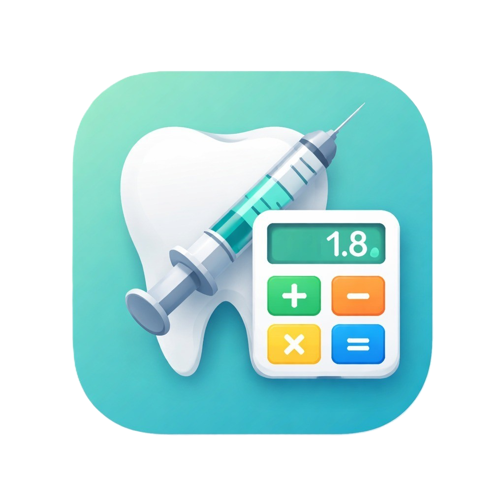
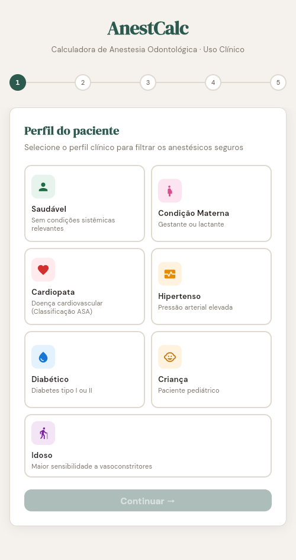
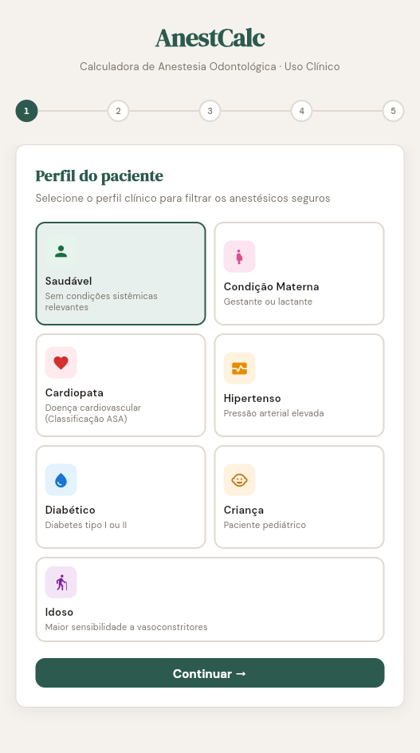
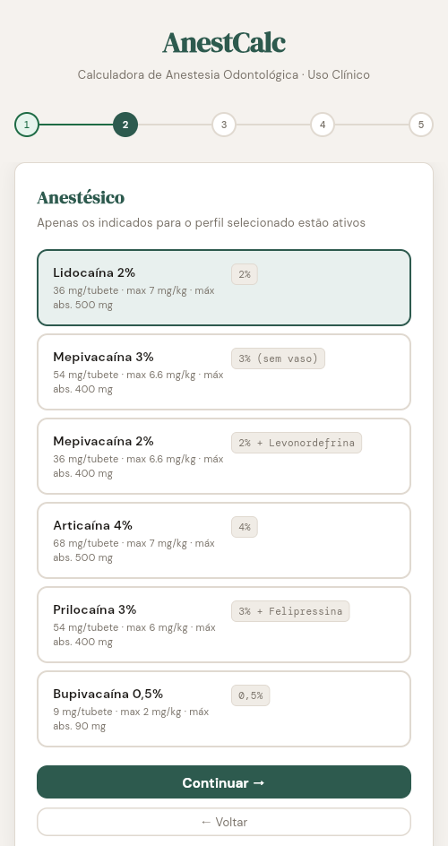
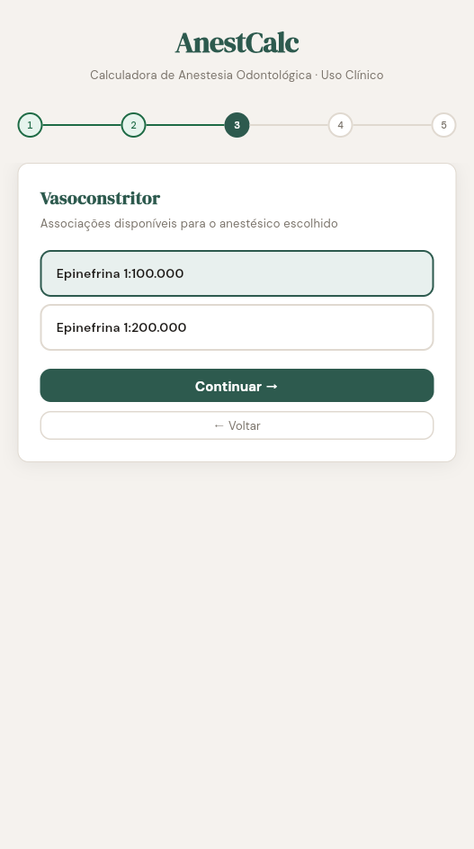
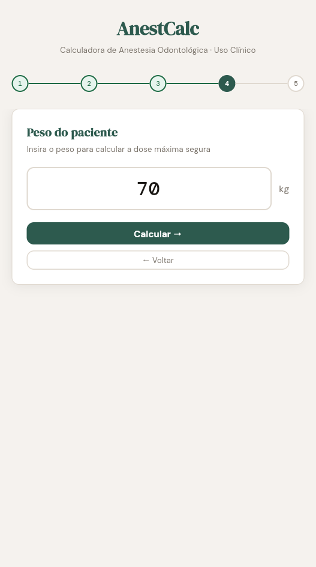
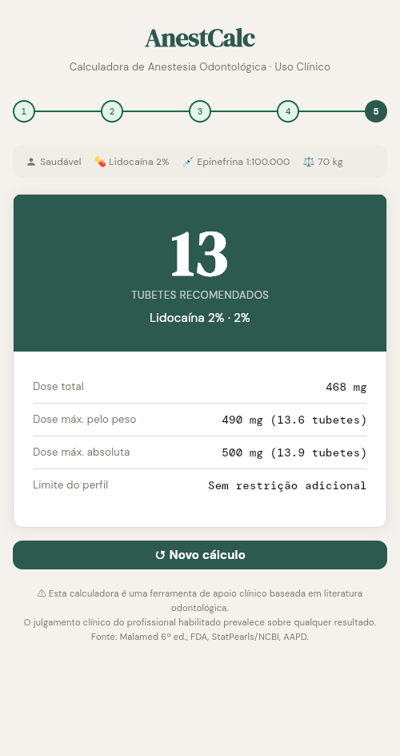

<div align="center">
  
  <h1>AnestCalc</h1>
  <p><strong>Calculadora de Anestesia Odontológica · Uso Clínico</strong></p>
</div>

AnestCalc é um aplicativo móvel e web desenvolvido em Flutter, projetado para auxiliar profissionais de odontologia no cálculo rápido e seguro de doses máximas de anestésicos locais, considerando diferentes perfis clínicos de pacientes.

## 📱 Screenshots

<div align="center" style="display: flex; flex-wrap: wrap; justify-content: center; gap: 10px;">
  
  
  
  
  
  
</div>

---

## ✨ Funcionalidades

- **Perfis Clínicos Personalizados:** Selecione o perfil do paciente para aplicar restrições clínicas automaticamente. Perfis suportados:
  - Saudável
  - Gestante / Lactante
  - Cardiopata
  - Hipertenso
  - Diabético
  - Criança
  - Idoso
- **Filtro de Anestésicos Seguros:** O aplicativo bloqueia ou alerta sobre anestésicos que são contraindicados para o perfil clínico selecionado.
- **Opções de Vasoconstritores:** Ajusta limites máximos em tubetes baseados na presença e concentração do vasoconstritor (Ex: Epinefrina, Felipressina, Levonordefrina ou sem vasoconstritor).
- **Cálculo Baseado no Peso:** Calcula rigorosamente a dose máxima em miligramas e faz a conversão em tubetes, apresentando o limite mais seguro entre dose máxima por peso, dose absoluta e restrição clínica.
- **Avisos Clínicos:** Emite alertas detalhados sobre as restrições aplicadas ao longo do cálculo (ex: contraindicação de prilocaína para gestantes).

> ⚠️ **Aviso de Responsabilidade:** Esta calculadora é uma ferramenta de apoio clínico baseada em literatura odontológica. O julgamento clínico do profissional habilitado prevalece sobre qualquer resultado. Fontes: Malamed 6ª ed., FDA, StatPearls/NCBI, AAPD.

## 🛠️ Tecnologias e Dependências

- **Framework:** [Flutter](https://flutter.dev/) (SDK ^3.11.4)
- **Linguagem:** Dart
- **Design:** Material Design customizado
- **Fontes:** Famílias tipográficas DM Sans, DM Serif Display e DM Mono.

## 🚀 Como Executar o Projeto

Certifique-se de ter o Flutter instalado e configurado em seu ambiente de desenvolvimento.

1. **Clone o repositório:**
   ```bash
   git clone https://github.com/gustavoareis/anest-calc.git
   cd anest-calc
   ```

2. **Instale as dependências:**
   ```bash
   flutter pub get
   ```

3. **Execute o aplicativo:**
   ```bash
   flutter run
   ```

## 🏗️ Build

Para compilar a versão final do aplicativo para Android ou iOS:

**Para Android (APK / AppBundle):**
```bash
flutter build apk
# ou
flutter build appbundle
```

**Para iOS:**
```bash
flutter build ios
```

---
<div align="center">
  <i>Desenvolvido com Flutter</i>
</div>
